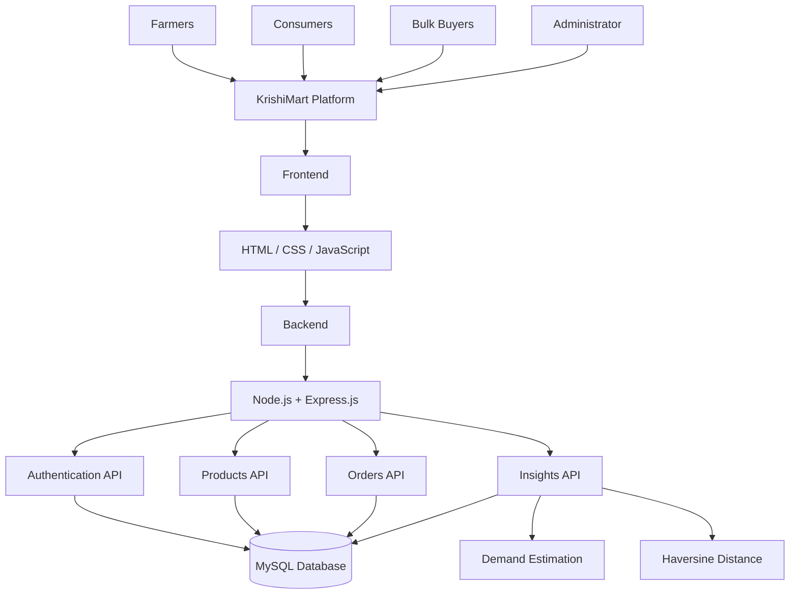
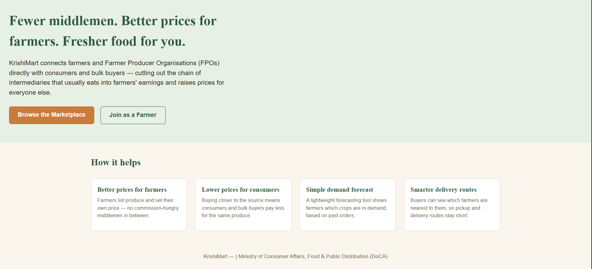
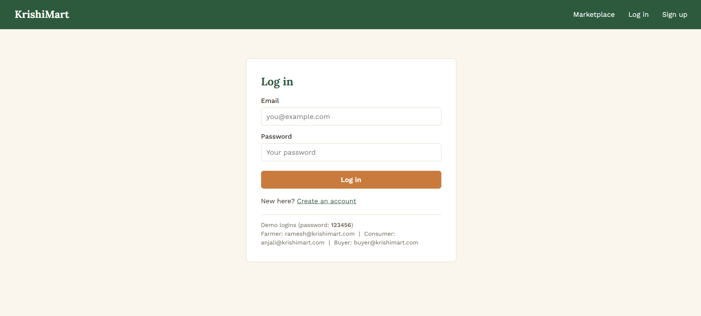
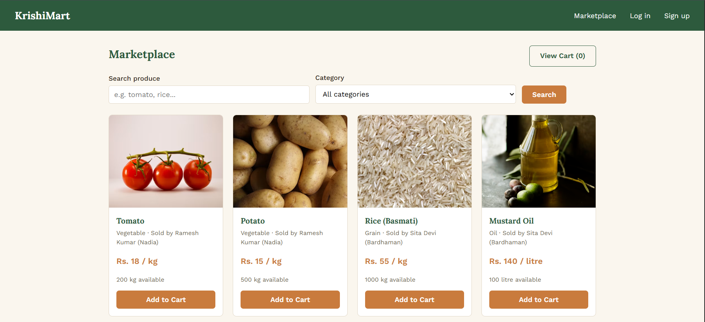
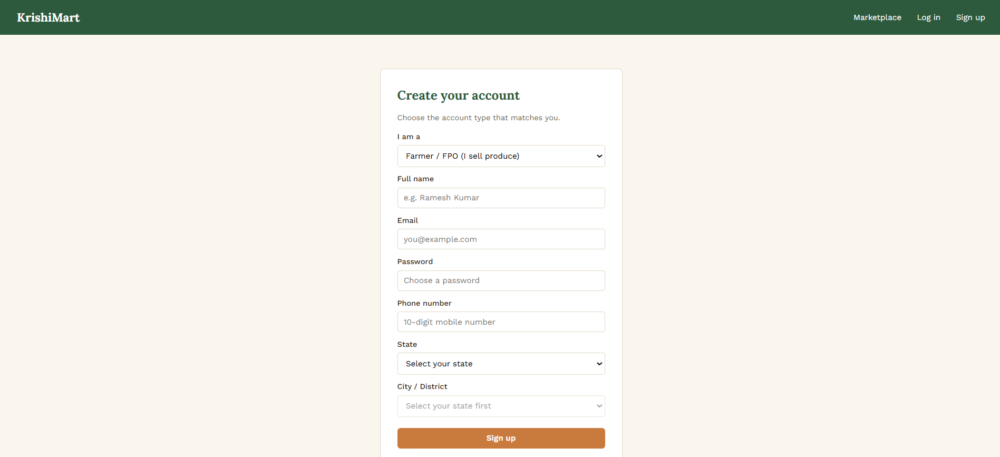
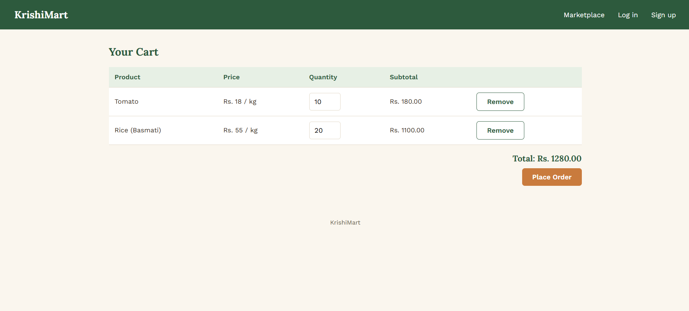

# 🌾 KrishiMart – SIH 2026

## Smart Digital Marketplace for Farmers

KrishiMart is a digital **agricultural marketplace** designed to connect **farmers directly with consumers and bulk buyers**, helping reduce the impact of multiple intermediaries on farmer earnings and consumer prices.

The platform provides dedicated interfaces for farmers, consumers, bulk buyers, and administrators, along with product listing, marketplace browsing, cart and order management, demand estimation, and location-based farmer information.

---

## 🎯 Problem Statement

> **"Multiple intermediaries reduce farmers' earnings and increase consumer prices."**

KrishiMart addresses this problem by providing a digital platform where farmers can list their agricultural products and consumers or bulk buyers can directly discover and purchase them.

The platform aims to make agricultural trade more direct, transparent, and accessible.

---

## 💡 Our Solution

KrishiMart creates a digital connection between farmers and buyers through a simple agricultural marketplace.

### 👨‍🌾 Farmers can:

- Register and log in
- Create agricultural product listings
- Set product prices
- Manage available stock
- View their listed products
- Remove products
- View orders received
- View demand estimation

### 🛒 Consumers can:

- Register and log in
- Browse agricultural products
- Search products
- Filter products by category
- View product information
- Add products to cart
- Place orders
- View previous orders
- Manage their profile

### 🏢 Bulk Buyers can:

- Register and log in
- Browse agricultural products
- Search and filter products
- Add products to cart
- Place orders
- View order history

### 👨‍💼 Administrator

The project includes an administrator dashboard interface for viewing:

- User information
- Product information
- Order information
- Marketplace statistics

---

## ✨ Key Features

### 👨‍🌾 Farmer Dashboard

- Farmer registration and login
- Add agricultural products
- View listed products
- Remove products
- Set product price and quantity
- View total listed products
- View total available stock
- View orders received
- View demand estimation

### 🛒 Marketplace

- Browse agricultural products
- Search products
- Filter products by category
- View product price
- View available quantity
- View farmer name
- View farmer city
- Add products to cart

### 🛍️ Cart & Orders

- Add products to cart
- Increase product quantity
- Place orders
- Calculate order total
- Reduce product stock after an order
- View previous orders
- View order details
- View orders received by farmers

### 🔐 Authentication

- User registration
- User login
- Multiple user roles
- Farmer account
- Consumer account
- Bulk buyer account
- Administrator account
- Browser-based login state using Local Storage

### 📊 Demand Estimation

The system uses historical order information to calculate an estimated demand for each product.

### 📍 Nearby Farmers

The system calculates the geographical distance between a buyer and registered farmers using the **Haversine formula**.

---

## 📊 Insights

### Demand Estimation

The backend provides a demand-estimation endpoint that calculates:

```text
Average Quantity Ordered
        =
Total Ordered Quantity
        ÷
Number of Times Ordered
```

The calculated average is returned as the estimated demand for the next order cycle.

This is a simple and explainable statistical approach. It can be extended to a more advanced machine-learning or time-series forecasting model in the future.

### Nearby Farmers

The system stores latitude and longitude information for users.

For the nearby-farmer feature:

1. The buyer provides latitude and longitude.
2. The system retrieves registered farmers with location information.
3. The Haversine formula calculates the distance.
4. Farmers are sorted from nearest to farthest.

This provides a foundation for future logistics and route-optimization functionality.

---

## 🏗️ System Architecture



---

## 🛠️ Technology Stack

### Frontend

- HTML5
- CSS3
- JavaScript
- Browser Local Storage

### Backend

- Node.js
- Express.js
- REST APIs
- CORS

### Database

- MySQL
- MySQL2

### Development Tools

- Visual Studio Code
- MySQL Workbench
- Git
- GitHub

---

## 📂 Project Structure

```text
KrishiMart-SIH-2026/
│
├── backend/
│   ├── server.js
│   ├── package.json
│   ├── app.py
│   ├── requirements.txt
│   │
│   ├── config/
│   │   └── db.js
│   │
│   └── routes/
│       ├── authRoutes.js
│       ├── insightsRoutes.js
│       ├── orderRoutes.js
│       └── productRoutes.js
│
├── database/
│   └── schema.sql
│
├── frontend/
│   ├── css/
│   │   └── style.css
│   │
│   ├── js/
│   │   ├── admin.js
│   │   ├── api.js
│   │   ├── auth.js
│   │   ├── cart.js
│   │   ├── farmer.js
│   │   ├── marketplace.js
│   │   ├── orders.js
│   │   └── profile.js
│   │
│   ├── admin-dashboard.html
│   ├── cart.html
│   ├── farmer-dashboard.html
│   ├── index.html
│   ├── login.html
│   ├── marketplace.html
│   ├── my-orders.html
│   ├── profile.html
│   └── register.html
│
└── README.md
```

---

## 🗄️ Database

KrishiMart uses **MySQL** as its central database.

### Users Table

The `users` table stores:

- User ID
- Name
- Email
- Password
- Role
- Phone
- Address
- State
- City
- Latitude
- Longitude
- Registration date

Supported roles:

```text
farmer
consumer
buyer
admin
```

### Products Table

The `products` table stores:

- Product ID
- Farmer ID
- Product name
- Category
- Price
- Unit
- Available quantity
- Description
- Product image URL
- Creation date

### Orders Table

The `orders` table stores:

- Order ID
- Buyer ID
- Total amount
- Order status
- Order date

### Order Items Table

The `order_items` table stores:

- Order item ID
- Order ID
- Product ID
- Farmer ID
- Quantity
- Price

---

## 🔗 Backend API

The Node.js backend runs on port `5000`.

Base API URL:

```text
http://localhost:5000/api
```

### Authentication

```text
/api/auth
```

Provides:

- User registration
- User login

### Products

```text
/api/products
```

Provides:

- Get products
- Search products
- Filter products by category
- Get products of a farmer
- Add products
- Remove products

### Orders

```text
/api/orders
```

Provides:

- Place orders
- Get buyer orders
- Get farmer orders

### Insights

```text
/api/insights
```

Provides:

- Demand estimation
- Nearby farmer calculation

---

## 📊 Problem Statement Implementation

| Requirement | KrishiMart Implementation |
|---|---|
| Direct farmer-buyer connection | Farmers can list agricultural products for buyers |
| Consumer access | Consumers can browse products and place orders |
| Bulk buyer access | Dedicated bulk buyer role |
| Digital marketplace | Agricultural products are displayed through the marketplace |
| Product management | Farmers can add and remove their products |
| Order management | Buyers can place orders and farmers can view received orders |
| Demand insights | Historical order data is used for demand estimation |
| Location support | Latitude and longitude can be stored for users |
| Nearby farmers | Haversine formula is used for distance calculation |
| Price transparency | Farmers define the selling price of their products |

---

## 👤 User Flow

### Farmer

```text
Register
   ↓
Login
   ↓
Farmer Dashboard
   ↓
Add Product
   ↓
Product Listed
   ↓
Receive Orders
   ↓
View Demand Estimation
```

### Consumer / Bulk Buyer

```text
Register
   ↓
Login
   ↓
Marketplace
   ↓
Search / Filter Products
   ↓
Add to Cart
   ↓
Place Order
   ↓
View Orders
```

### Administrator

```text
Admin Login
     ↓
Admin Dashboard
     ↓
View Users
     ↓
View Products
     ↓
View Orders
```

---

## 🚀 How to Run

### Prerequisites

Install:

- Node.js
- MySQL
- MySQL Workbench
- Visual Studio Code
- Modern web browser

---

### 1. Clone the Repository

```bash
git clone https://github.com/Abhirup-kar2004/KrishiMart-SIH-2026.git
cd KrishiMart-SIH-2026
```

---

### 2. Create the Database

Open **MySQL Workbench**.

Open:

```text
database/schema.sql
```

Run the complete SQL script.

This creates the:

```text
krishimart
```

database and the required tables.

The SQL file also contains sample users and sample agricultural products for demonstration.

---

### 3. Configure MySQL

Open:

```text
backend/config/db.js
```

The default local configuration expects:

```text
Host: localhost
User: root
Database: krishimart
Port: MySQL default port
```

Set your own MySQL password in the local configuration if required.

**Do not upload real passwords or private credentials to GitHub.**

---

### 4. Install Backend Dependencies

Open a terminal inside the backend folder:

```bash
cd backend
npm install
```

---

### 5. Start the Backend

Run:

```bash
node server.js
```

Or use:

```bash
npm start
```

The backend will run at:

```text
http://localhost:5000
```

You should see:

```text
KrishiMart server running at http://localhost:5000
```

---

### 6. Start the Frontend

Open:

```text
frontend/index.html
```

You can also use **VS Code Live Server**.

The frontend communicates with the backend through:

```text
http://localhost:5000/api
```

---

## 🧪 Sample Database Data

The `database/schema.sql` file includes sample data for demonstration.

### Farmer

```text
Name: Ramesh Kumar
Email: ramesh@krishimart.com
Role: farmer
```

### Farmer

```text
Name: Sita Devi
Email: sita@krishimart.com
Role: farmer
```

### Consumer

```text
Name: Anjali Roy
Email: anjali@krishimart.com
Role: consumer
```

### Bulk Buyer

```text
Name: Green Hotel Pvt Ltd
Email: buyer@krishimart.com
Role: buyer
```

The sample database currently uses the demonstration password:

```text
123456
```

> These are prototype/demo credentials only and should not be used in a production deployment.

---

## 🔐 Security Considerations

This project is developed as a **hackathon prototype**.

The current authentication implementation is simplified for demonstration purposes.

For production deployment, the following improvements should be implemented:

- Password hashing using bcrypt or another secure hashing method
- Secure authentication and session management
- Role-based authorization
- Input validation
- Environment variables for credentials
- HTTPS
- Secure database configuration
- Protection against SQL injection
- Secure handling of user information
- Proper access control for API endpoints

---

## 🔮 Future Scope

KrishiMart can be further enhanced with:

- Machine-learning based demand forecasting
- Real-time agricultural market prices
- Online payment integration
- Farmer and FPO verification
- Real-time order tracking
- Advanced route optimization
- Multilingual support
- Mobile application
- Weather-based agricultural insights
- Push notifications
- Cloud deployment
- Advanced analytics and reporting
- Secure production authentication
- Scalable cloud database infrastructure

---
## 🖥️ Application Preview

### 🏠 Home Page


### 🔐 Login Page


### 🛒 Marketplace


### 👨‍🌾 Farmer Dashboard


### 🛍️ Shopping Cart


## 📌 Project Status

**Prototype – Smart India Hackathon 2026**

KrishiMart demonstrates a digital agricultural marketplace with farmer, consumer, bulk buyer, and administrator interfaces, product listing and discovery, cart and order management, MySQL database integration, demand estimation, and location-based nearby farmer functionality.

---

## 📄 License

This project was developed as part of **Smart India Hackathon 2026** for educational and hackathon purposes.
